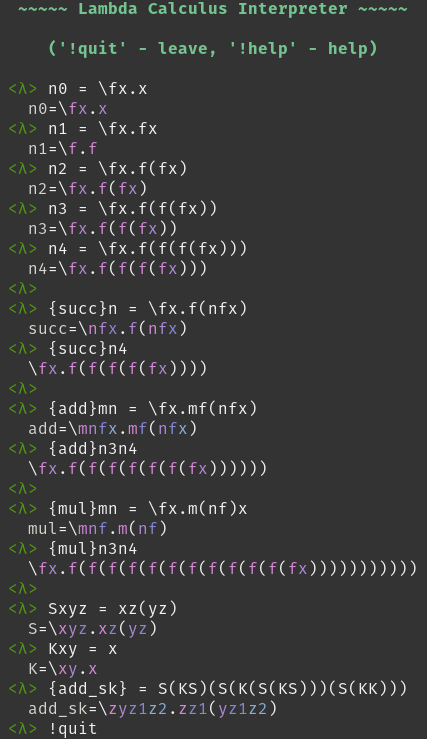

# LambdaCalc
A call-by-name lambda calculus interpreter in OCaml

Run with `ocaml lcalc.ml`.

For readline support, install `rlwrap` or something similar, and do `rlwrap
ocaml lcalc.ml`.

For ANSI colors, do `ocaml lcalc.ml -ansi` or `rlwrap -A ocaml lcalc.ml -ansi`.

The call-by-value evaluator is based on
[this][https://www.cl.cam.ac.uk/~lp15/MLbook/PDF/chapter9.pdf].

# Screenshots

This screenshot above demonstrates:

 * the church encoding of 0-4, where 1 is eta-reduced to the identity function,
 * the successor, add, and multiply operations, written in functional style,
 * the S and K combinators,
 * the add function expressed with S and K combinators, demonstrating
   alpha-conversion to prevent captured variables.
